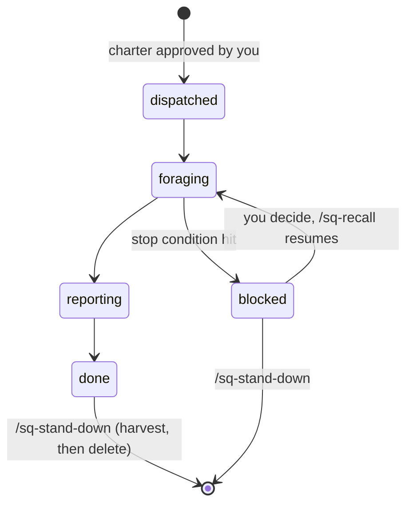

# Elephant, Goldfish, and Squirrels

An extension of [elephant-goldfish](https://github.com/vshvedov/elephant-goldfish) for agentic software work. It keeps the elephant/goldfish pattern intact and adds a third role: the **squirrel**, an autonomous, charter-bound unit that owns a scoped sub-task on your behalf.

> **Status:** v0. The Claude Code adapter is usable. Codex and Gemini CLI adapters are planned (see `codex/` and `gemini/`).

---

## Why squirrels?

Elephant/goldfish gives you two roles:

- The **elephant** is your working session. It has full context and carries institutional memory.
- A **goldfish** is a fresh subagent with no context, used as a cold-reader check.

That covers *thinking* and *verification*. It does not cover *delegation*: "go watch CI on this branch," "gather prior art for the PRD," "keep the migration inventory current." Those tasks are bounded, autonomous, and need to survive across turns. A goldfish forgets by design, and the elephant shouldn't spend its context on them.

A **squirrel** is that delegate. In the same way an *agent* acts for an LLM, a squirrel acts for **you**: it is given a mandate, forages within a defined scope, caches what it finds in a stash, and reports back. It stops and escalates when it hits a boundary.

| Animal | Role | Memory | Autonomy |
| --- | --- | --- | --- |
| **Elephant** | Your working session; integrates everything | Long (conversation + repo instructions) | Collaborative, you stay in the loop |
| **Goldfish** | Fresh-context subagent; the cold-reader check | None, by design | Narrow, disposable |
| **Squirrel** | Charter-bound delegate for a sub-task | Its own stash (resumable) | Bounded, acts for you within a charter |

### Two tests

- **Goldfish test (upstream):** if a goldfish given only the design doc can't implement what you intended, the doc is wrong.
- **Squirrel test:** if a squirrel can't resume from its charter and stash alone, the charter is wrong.

---

## The division of labor


Squirrels *do and remember*. Goldfish *verify cold*. The elephant *integrates*. Squirrels never review their own work, and that stays the goldfish's job.

---

## How it extends elephant-goldfish

- **Additive install.** The bootstrap checks that the base `eg-*` workflow is present, offers to install it if not, then layers the squirrel commands on top. Existing setups for other AIs are preserved.
- **Separate namespace.** Upstream commands use the `eg-` prefix and squirrel commands use `sq-`, so the two sets never collide and each is easy to grep.
- **Same adaptive injection.** Templates carry `[BOOTSTRAP: ...]` markers that are filled in from your local stack when you install.
- **Same stop rule.** Nothing here commits for you. Squirrels stop at their charter's boundary and the elephant stops before commit.
- **A file-based inventory.** Each squirrel is one markdown file with frontmatter, in the spirit of [opys](https://github.com/BohdanTkachenko/opys), and `scripts/sq-verify.sh` is a CI gate for charters.

### Where squirrels fit in the EG pipeline

| EG stage | Squirrel role |
| --- | --- |
| `eg-brainstorm` / `eg-prd` | Forage sources, prior art, and codebase surfaces; stash results for the elephant to synthesize |
| `eg-new-feature` | Own layer-by-layer implementation sub-tasks. Goldfish still gate the design doc |
| `eg-fix-bug` | Reproduce and bisect in a scoped area; report findings |
| `eg-precommit-review` | Unchanged. The goldfish reviewer stays independent of any squirrel |

---

## Install (Claude Code)

In your target repo, open a Claude Code session and paste:

```
Fetch the elephant-goldfish-squirrels bootstrap procedure with
`gh api repos/<your-github-user>/elephant-goldfish-squirrels/contents/claude/BOOTSTRAP.md -H 'Accept: application/vnd.github.raw'`,
then follow the procedure to set up the squirrel workflow here, preserving any existing setups for other AIs.
```

Replace `<your-github-user>` with the account that hosts this repo. Restart the session and type `/sq-` to see the commands.

## Commands

| Intent | Claude Code |
| --- | --- |
| Dispatch a squirrel on a sub-task | `/sq-dispatch <mandate>` |
| See all squirrels and their state | `/sq-status` |
| Query or resume a squirrel's stash | `/sq-recall <SQ-id> [question or new instruction]` |
| Harvest findings, then retire a squirrel | `/sq-stand-down <SQ-id>` |

## The squirrel lifecycle



## Guardrails

- **No dispatch before the charter is approved.** The elephant drafts the charter and you approve it.
- **Access is declared.** `read-only` (default), `stash-write`, or `scoped-write` (writes only inside the listed scope).
- **Every charter has a budget and stop conditions.** Hitting one sets the squirrel to `blocked` and returns an escalation. It does not improvise.
- **Squirrels never commit, push, or touch secrets.**
- **Ephemeral by default.** On stand-down, durable findings are promoted to where you choose, then the charter and stash are deleted.

See [`squirrels/SPEC.md`](squirrels/SPEC.md) for the normative format.

## Repo layout

```
.
├── README.md
├── BOOTSTRAP.md          # compatibility entrypoint, points at claude/
├── PROMPTS.md            # update prompt (smart-merge, as upstream)
├── NOTICE.md             # attribution
├── squirrels/
│   ├── SPEC.md           # tool-agnostic spec: charter, stash, lifecycle
│   └── templates/charter.md
├── claude/               # Claude Code adapter (BOOTSTRAP.md, commands/, snippet.md)
├── codex/                # planned
├── gemini/               # planned
├── scripts/sq-verify.sh  # CI gate for charters
└── examples/.squirrels/  # a sample charter
```

## Credits

Built on [elephant-goldfish](https://github.com/vshvedov/elephant-goldfish) by vshvedov, which implements the pattern from [Dave Rensin's article](https://drensin.medium.com/elephants-goldfish-and-the-new-golden-age-of-software-engineering-c33641a48874). The file-based inventory and CI-verification ideas come from [opys](https://github.com/BohdanTkachenko/opys). See [NOTICE.md](NOTICE.md).

## License

Apache-2.0. See [LICENSE](LICENSE) and [NOTICE.md](NOTICE.md).
