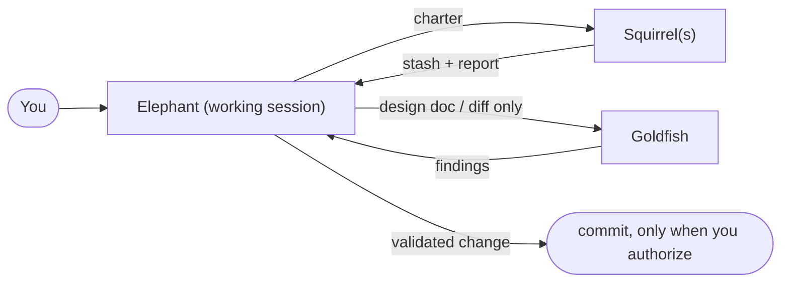
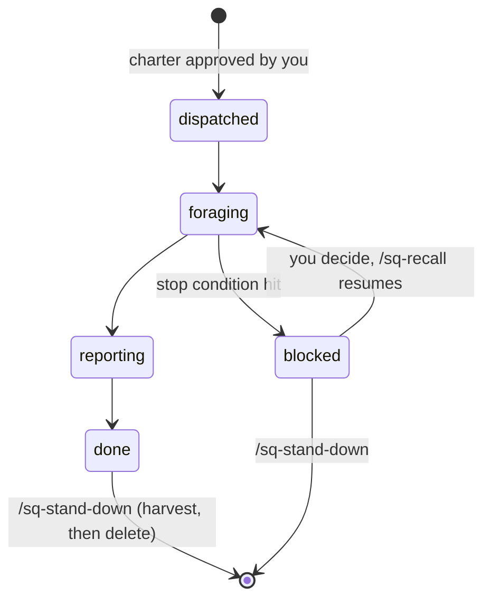

# Elephant, Goldfish, and Squirrels

Squirrels (Elephant, Goldfish, and Squirrels) is an extension of [elephant-goldfish](https://github.com/vshvedov/elephant-goldfish) for agentic software work. It keeps the elephant/goldfish pattern intact and adds a third role: the **squirrel**, an autonomous, charter-bound unit that owns a scoped sub-task on your behalf.

> **Status:** v0.2. Expanded with **10 specialized Squirrel archetypes** (`sq-*`). The Claude Code adapter is fully usable. Codex and Gemini CLI adapters are planned (see `codex/` and `gemini/`).

---

## Why squirrels?

Elephant/goldfish gives you two roles:

- The **elephant** is your working session. It has full context and carries institutional memory.
- A **goldfish** is a fresh subagent with no context, used as a cold-reader check.

That covers *thinking* and *verification*. It does not cover *delegation*: "go watch CI on this branch," "gather prior art for the PRD," "keep the migration inventory current." Those tasks are bounded, autonomous, and need to survive across turns. A goldfish forgets by design, and the elephant shouldn't spend its context on them.

A **squirrel** is that delegate. In the same way an *agent* acts for an LLM, a squirrel acts for **you**: it is given a mandate, forages within a defined scope, caches what it finds in a stash, and reports back. It stops and escalates when it hits a boundary.

| Animal | Role | Memory | Autonomy |
| --- | --- | --- | --- |
| **Elephant** | Your working session; integrates everything | Long (conversation + repo instructions) | Collaborative, you stay in the loop |
| **Goldfish** | Fresh-context subagent; the cold-reader check | None, by design | Narrow, disposable |
| **Squirrel** | Charter-bound delegate for a sub-task | Its own stash (resumable) | Bounded, acts for you within a charter |

### Two tests
- **Goldfish test (upstream):** if a goldfish given only the design doc can't implement what you intended, the doc is wrong.
- **Squirrel test:** if a squirrel can't resume from its charter and stash alone, the charter is wrong.

---

## Squirrel Archetypes (`sq-*`) 🐿️

To standardize common delegation workflows, Squirrels defines **10 specialized archetypes**:

| Archetype | Claude Command | Default Access | Description |
| --- | --- | --- | --- |
| **afk** | `/sq-afk <queue>` | `scoped-write` / `read-only` | Automation specifications for when you are away. Monitors or completes a list of tasks and strictly halts on ambiguity. |
| **review** | `/sq-review <topic>` | `stash-write` | Literature review of all similar projects and prior art collected into a synthesis report. |
| **mock** | `/sq-mock <interface>` | `scoped-write` / `stash-write` | Builds a simple runnable mock example of the design to validate ergonomics before full coding. |
| **verify** | `/sq-verify <checklist>` | `read-only` | Checklist of tests and invariants to see if implementation is proceeding as expected. |
| **scribe** | `/sq-scribe <SQ-id> <change>` | `scoped-write` | Modifies, maintains, or amends a squirrel charter while preserving frontmatter validity. |
| **report** | `/sq-report [focus]` | `read-only` | Creates a 360° summary of what is happening, blockers, decisions needed, next steps, landed impact, and future work. |
| **next** | `/sq-next [context]` | `read-only` | Immediate next steps bifurcated cleanly into what the human needs to do vs what the agent can/is doing. |
| **done** | `/sq-done [milestone]` | `read-only` | Keeps track of long-term finish line goals (Definition of Done) and guards against scope creep. |
| **pr** | `/sq-pr [branch]` | `read-only` | Knows preferences and context for how you submit code (commit style, test plan, PR description). |
| **clarify** | `/sq-clarify <doc>` | `scoped-write` / `stash-write` | Simplifies or elaborates when necessary; removes redundancy, stale context, or unhelpful information. |

> The charter validator script is named **`scripts/sq-charter.sh`**.

---

## The division of labor



Squirrels *do and remember*. Goldfish *verify cold*. The elephant *integrates*. Squirrels never review their own work, and that stays the goldfish's job.

---

## How it extends elephant-goldfish

- **Additive install.** The bootstrap checks that the base `eg-*` workflow is present, offers to install it if not, then layers the squirrel commands on top.
- **Separate namespace.** Upstream commands use the `eg-` prefix and squirrel commands use `sq-`.
- **Specialized archetypes.** 10 purpose-built archetypes with pre-structured templates, default access levels, and report schemas.
- **File-based inventory & CI gate.** Each squirrel is one markdown file with frontmatter in `.squirrels/`, and `scripts/sq-charter.sh` acts as the CI integrity gate.
- **Same stop rule.** Nothing here commits for you. Squirrels stop at their charter boundary and the elephant stops before commit.

---

## Install (Claude Code)

In your target repo, open a Claude Code session and paste:

```
Fetch the elephant-goldfish-squirrels bootstrap procedure with
`gh api repos/sherol/squirrels/contents/claude/BOOTSTRAP.md -H 'Accept: application/vnd.github.raw'`,
then follow the procedure to set up the squirrel workflow here, preserving any existing setups for other AIs.
```

Restart the session and type `/sq-` to see the available commands.

## Core Commands

| Intent | Claude Code / CLI |
| --- | --- |
| Dispatch generic squirrel | `/sq-dispatch <mandate>` |
| Dispatch specific archetype | `/sq-afk`, `/sq-review`, `/sq-mock`, `/sq-verify`, `/sq-scribe`, `/sq-report`, `/sq-next`, `/sq-done`, `/sq-pr`, `/sq-clarify` |
| See all squirrels and their state | `/sq-status` |
| Query or resume a squirrel's stash | `/sq-recall <SQ-id> [question or new instruction]` |
| Harvest findings, then retire a squirrel | `/sq-stand-down <SQ-id>` |
| Validate charter schema in CI / terminal | `bash scripts/sq-charter.sh [dir]` |

## The squirrel lifecycle



## Guardrails

- **No dispatch before the charter is approved.** The elephant drafts the charter and you approve it.
- **Access is declared.** `read-only` (default), `stash-write`, or `scoped-write` (writes only inside the listed scope).
- **Every charter has a budget and stop conditions.** Hitting one sets the squirrel to `blocked` and returns an escalation. It does not improvise.
- **Squirrels never commit, push, or touch secrets.**
- **Ephemeral by default.** On stand-down, durable findings are promoted to where you choose, then the charter and stash are deleted.

See [`squirrels/SPEC.md`](squirrels/SPEC.md) for the normative specification.

## Repo layout

```
.
├── README.md
├── BOOTSTRAP.md          # compatibility entrypoint
├── PROMPTS.md            # update prompt
├── NOTICE.md             # attribution
├── squirrels/
│   ├── SPEC.md           # tool-agnostic spec: charter, stash, lifecycle, 10 archetypes
│   └── templates/
│       ├── charter.md          # base template
│       ├── charter-afk.md      # away from keyboard automation
│       ├── charter-review.md   # literature & prior art review
│       ├── charter-mock.md     # design prototyping
│       ├── charter-verify.md   # verification checklist
│       ├── charter-scribe.md   # charter amendment
│       ├── charter-report.md   # 360° situational report
│       ├── charter-next.md     # human vs agent next steps
│       ├── charter-done.md     # finish line & definition of done
│       ├── charter-pr.md       # pull request & convention context
│       └── charter-clarify.md  # information distiller
├── claude/
│   ├── BOOTSTRAP.md
│   ├── snippet.md
│   └── commands/         # /sq-dispatch, /sq-status, /sq-recall, /sq-stand-down,
│                         # /sq-afk, /sq-review, /sq-mock, /sq-verify, /sq-scribe,
│                         # /sq-report, /sq-next, /sq-done, /sq-pr, /sq-clarify
├── codex/                # planned
├── gemini/               # planned
├── scripts/
│   └── sq-charter.sh     # CI gate & charter validator (checks frontmatter, sections, schema)
└── .squirrels/           # sample charters (SQ-0001 through SQ-0010)
```

## Credits

Built on [elephant-goldfish](https://github.com/vshvedov/elephant-goldfish) by vshvedov, which implements the pattern from [Dave Rensin's article](https://drensin.medium.com/elephants-goldfish-and-the-new-golden-age-of-software-engineering-c33641a48874). The file-based inventory and CI-verification ideas come from [opys](https://github.com/BohdanTkachenko/opys). See [NOTICE.md](NOTICE.md).

## License

Apache-2.0. See [LICENSE](LICENSE) and [NOTICE.md](NOTICE.md).
